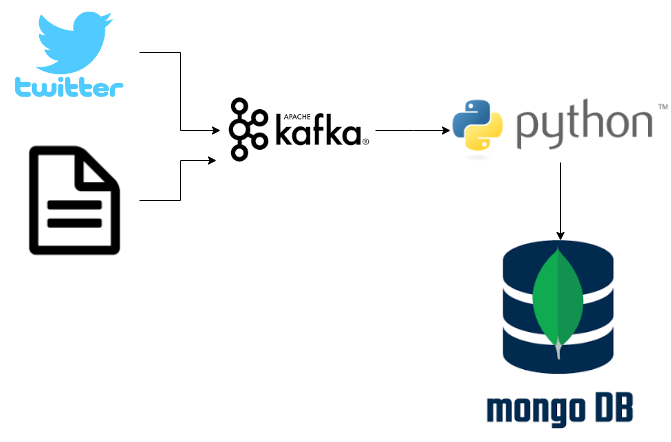

# Real-time streaming and batch data pipeline 

This is a data pipeline to stream live Tweets through a message broker (Kafka), a processing, and finally storing in a database (MongoDB).

This application uses Docker for containerization.

## Architecture Overview


# Usage:
1. 
Set the TOPIC to whatever you want to call it.
Do not change BOOTSTRAP_SERVERS as it is already configured to connect to the Docker container that runs Kafka.
```
	BOOTSTRAP_SERVERS = "kafka:9092"
	TOPIC = "topicname"
```

2.
MongoDB

Set the DATABASE name and COLLECTION name.
Do not change CONNECTION_STRING as it is already configured to connect to the Docker container that runs MongoDB.
```
CONNECTION_STRING = "mongodb://mongo:27017"
DATABASE = "dbname"
COLLECTION = "collectionname"
```
3. 
Twitter API configuration
```
Create a twitter account if you do not already have one.
Go to https://apps.twitter.com/ and log in with your twitter credentials.
Click "Create New App"
Fill out the form, agree to the terms, and click "Create your Twitter application"
In the next page, click on "API keys" tab, and copy your "API key" and "API secret".
Scroll down and click "Create my access token", and copy your "Access token" and "Access token secret".
```
Fill in the keys and tokens
```
CONSUMER_KEY = "..."
CONSUMER_KEY_SECRET = "..."
ACCESS_TOKEN = "..."
ACCESS_TOKEN_SECRET = "..."
```
4. 
Change KEYWORDS to be a list of words to filter tweets on. Any tweet that contains these words will be returned in the streaming query. Change LANGUAGES to the languages of tweets you want to return. Currently set to english.
```
KEYWORDS = "IKEA"
```
5.
In the top level directory containing docker-compose.yml,

Run ```docker-compose up``` to create and start the containers. This may take several minutes, and more to download/build the images first.

Once running, you can visit http://localhost:8081 to browse the database on mongo-express, a web-based MongoDB admin interface.

6.
Hit Control-C to gracefully stop the containers.

Run ```docker-compose down``` to remove the containers and network.


